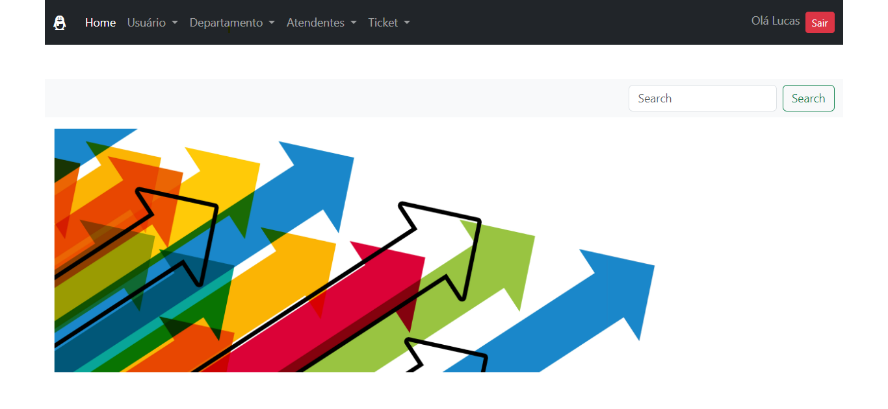

  

# Ticket Management System

I developed this system to hone my skills in PHP and MySQL. Throughout the process, I had the opportunity to explore additional tools that proved instrumental in bringing this project to fruition.

## ✅ Features
- Efficient ticket tracking and control
- Responsive web design for seamless user experience
- Integration of Dompdf library for printable user lists

## 📜 Usage
1. Ensure you have XAMPP installed on your system.
2. Start the Apache and MySQL services in XAMPP.
3. Import the provided SQL file into your MySQL database.
4. Navigate to the project directory in your web server's document root.
5. Open the `config.php` file and set up your database connection details.
6. Access the application in your web browser.
7. Create a new account by providing your name, username, password (MD5 hashed), and role.
8. Start managing your tickets!

## 🖥️ Technologies Used
- PHP
- JavaScript
- Bootstrap
- HTML
- CSS
- Dompdf library
